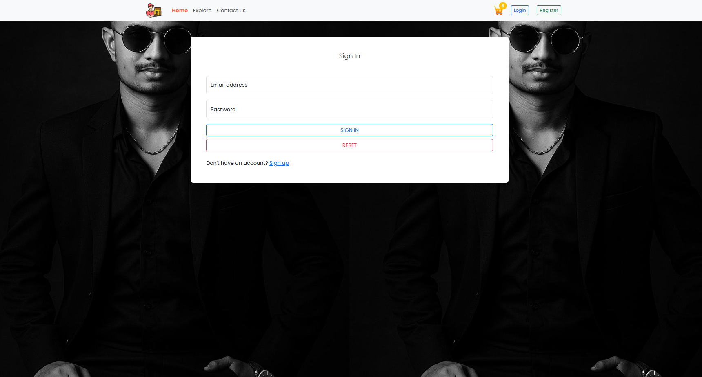
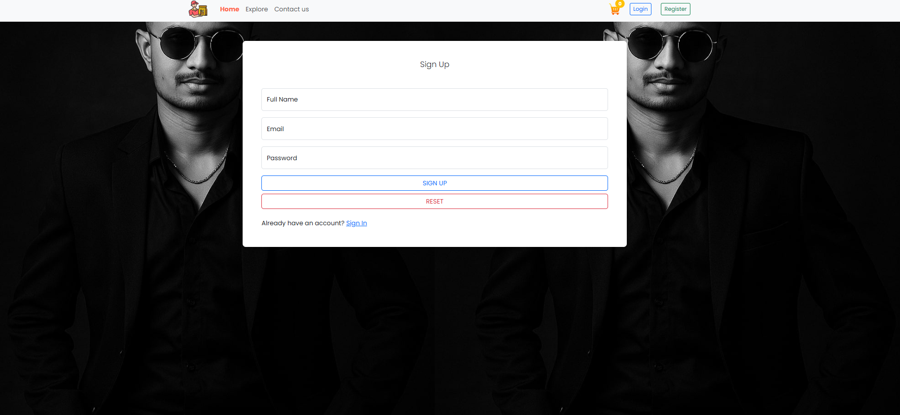
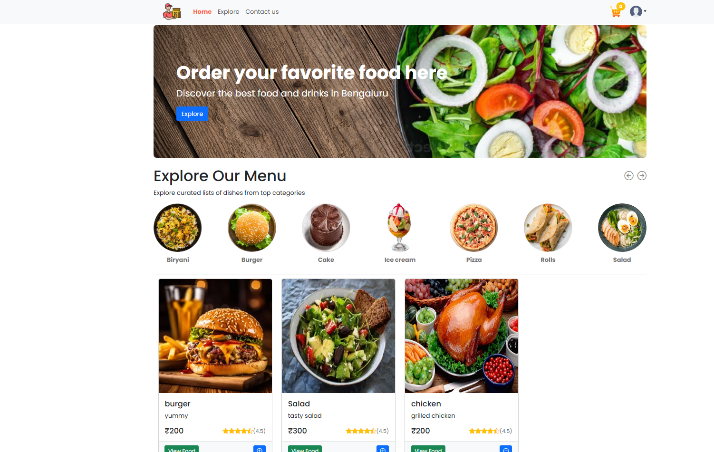
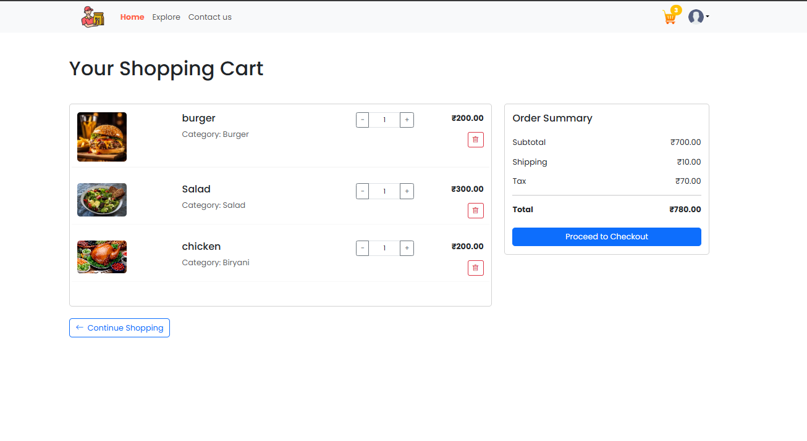
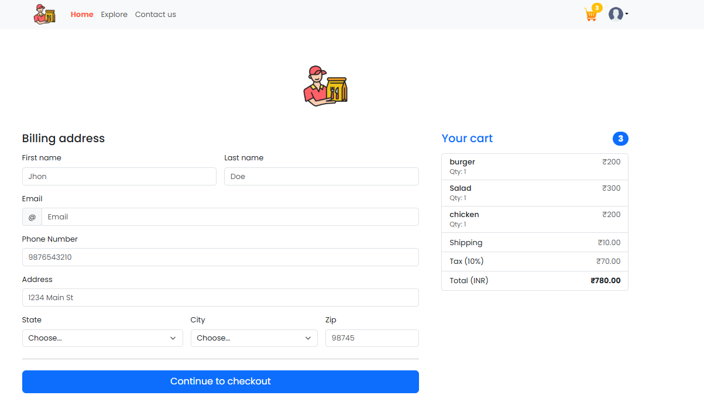

# 🍔 FoodLand - Online Food Ordering Platform (User App)

<div align="center">


**Order your favorite food with ease - Discover the best food and drinks in Bengaluru**

[](https://onlinefoodrohit.netlify.app/)
[](https://github.com/Rohit6168/onlinefoodwebapp)
[](https://reactjs.org/)
[](https://netlify.com/)

</div>

---

## 📋 Table of Contents

- [Overview](#-overview)
- [Features](#-features)
- [Tech Stack](#-tech-stack)
- [Screenshots](#-screenshots)
- [Getting Started](#-getting-started)
- [Project Structure](#-project-structure)
- [API Integration](#-api-integration)
- [Payment Gateway](#-payment-gateway)
- [Related Repositories](#-related-repositories)
- [Contributing](#-contributing)
- [Contact](#-contact)

---

## 🌟 Overview

FoodLand is a modern online food ordering platform that connects food lovers with their favorite restaurants. The user-facing application provides a seamless experience for browsing menus, adding items to cart, placing orders, and tracking delivery status in real-time.

### 🎯 Key Highlights

- 🍕 **Browse Menu** - Explore curated lists of dishes from top categories
- 🛒 **Shopping Cart** - Easy cart management with quantity controls
- 💳 **Secure Payments** - Razorpay integration for UPI and card payments
- 📦 **Order Tracking** - Real-time order status updates
- 🔐 **User Authentication** - Secure registration and login
- 📱 **Responsive Design** - Works seamlessly on all devices

---

## ✨ Features

### 🔐 Authentication
- ✅ **User Registration** with full name, email, and password
- 🔑 **Secure Login** with JWT authentication
- 🔒 **Password Reset** functionality
- 👤 **User Profile Management**

### 🏠 Home Page
- 🎨 **Hero Section** with attractive food imagery
- 📂 **Category Menu** (Biryani, Burger, Cake, Ice Cream, Pizza, Rolls, Salad)
- 🍽️ **Featured Dishes** with images, descriptions, ratings, and prices
- ⭐ **Star Ratings** (4.5/5 stars display)
- 🔍 **Category Filtering** for easy navigation

### 🛒 Shopping Cart
- ➕ **Add to Cart** with quantity selector
- ➖ **Quantity Management** (increase/decrease items)
- 🗑️ **Remove Items** from cart
- 💰 **Price Calculation**
  - Subtotal
  - Shipping charges (₹10.00)
  - Tax (10%)
  - Total amount
- 🔄 **Continue Shopping** option
- ✅ **Proceed to Checkout** button

### 📋 Checkout Process
- 📍 **Billing Address Form**
  - First Name & Last Name
  - Email Address
  - Phone Number
  - Full Address
  - State & City selection
  - ZIP Code
- 📦 **Order Summary** sidebar
  - Item list with quantities
  - Price breakdown
  - Total amount
- 💳 **Payment Integration** with Razorpay

### 💳 Payment Gateway (Razorpay)
- 📱 **UPI QR Code** payment
- 💳 **UPI ID/Number** payment
- 🔐 **Secure Payment Processing**
- ✅ **Payment Success Confirmation**
- 📧 **Transaction Details** with UPI ID
- 🎉 **Success Animation** with redirect countdown

### 📦 Order Management
- 📋 **Order History** page
- 🔄 **Real-time Status Updates**
  - 🟡 Preparing
  - 🔵 Food Preparing
  - 🟢 Out for Delivery
  - ✅ Delivered
- 📄 **Order Details**
  - Order items list
  - Total amount
  - Delivery address
  - Order date & time
- 😊 **Order Status Emoji** indicators

### 👤 User Dashboard
- 📊 **Order History** view
- 🚪 **Logout** functionality
- 👨‍💼 **Profile Menu** dropdown

---

## 🛠 Tech Stack

### Frontend


- ⚛️ **React 18** - UI library for building user interfaces
- ⚡ **Vite** - Lightning-fast build tool with HMR
- 🎨 **CSS3** - Modern styling with responsive design
- 🧭 **React Router DOM** - Client-side routing
- 🌐 **Axios** - HTTP client for API requests

### Backend Integration


- 🍃 **Spring Boot** - Backend REST API
- 🔐 **JWT** - Token-based authentication
- 🗄️ **MySQL** - Database for storing user and order data

### Payment Gateway


- 💳 **Razorpay** - Payment processing for UPI, cards, and net banking

### Deployment


- 🌐 **Netlify** - Frontend hosting with continuous deployment
- 🔄 **CI/CD** - Automatic deployment from GitHub

---

## 📸 Screenshots

### 🔐 Authentication
<table>
  <tr>
    <td><br/><b>Sign In Page</b></td>
    <td><br/><b>Registration Page</b></td>
  </tr>
</table>

### 🏠 Browse & Shop
<table>
  <tr>
    <td><br/><b>Home Page with Menu</b></td>
    <td><br/><b>Shopping Cart</b></td>
  </tr>
</table>

### 💳 Checkout & Payment
<table>
  <tr>
    <td><br/><b>Billing Address Form</b></td>
    <td><br/><b>Razorpay Payment Gateway</b></td>
  </tr>
  <tr>
    <td colspan="2"><br/><b>Payment Successful</b></td>
  </tr>
</table>

### 📦 Order Management
<table>
  <tr>
    <td><br/><b>Order History with Status</b></td>
  </tr>
</table>

---

## 🚀 Getting Started

### Prerequisites

- 💻 **Node.js** (v18 or higher)
- 📦 **npm** or **yarn**
- 🔧 **Git**

### Installation & Setup

1. **📥 Clone the repository**
   ```bash
   git clone https://github.com/Rohit6168/onlinefoodwebapp.git
   cd onlinefoodwebapp
   ```

2. **📦 Install dependencies**
   ```bash
   npm install
   # or
   yarn install
   ```

3. **⚙️ Configure environment variables**
   
   Create a `.env` file in the root directory:
   ```env
   VITE_API_BASE_URL=http://localhost:8080/api
   VITE_RAZORPAY_KEY_ID=your_razorpay_key_id
   ```

4. **🚀 Start development server**
   ```bash
   npm run dev
   # or
   yarn dev
   ```
   
   The application will run on `http://localhost:5173`

5. **🏗️ Build for production**
   ```bash
   npm run build
   # or
   yarn build
   ```

6. **🌐 Deploy to Netlify**
   
   The app is configured for Netlify deployment:
   - Connect your GitHub repository to Netlify
   - Or use Netlify CLI:
   ```bash
   npm install -g netlify-cli
   netlify deploy --prod
   ```

**🌍 Live Demo:** [https://onlinefoodrohit.netlify.app/](https://onlinefoodrohit.netlify.app/)

---

## 📁 Project Structure

```
onlinefoodwebapp/
├── public/
│   └── assets/
│       └── images/
├── src/
│   ├── components/
│   │   ├── Auth/
│   │   │   ├── SignIn.jsx
│   │   │   └── SignUp.jsx
│   │   ├── Home/
│   │   │   ├── HomePage.jsx
│   │   │   ├── CategoryMenu.jsx
│   │   │   └── FoodCard.jsx
│   │   ├── Cart/
│   │   │   ├── ShoppingCart.jsx
│   │   │   └── CartItem.jsx
│   │   ├── Checkout/
│   │   │   ├── CheckoutForm.jsx
│   │   │   └── OrderSummary.jsx
│   │   ├── Orders/
│   │   │   ├── OrderHistory.jsx
│   │   │   └── OrderCard.jsx
│   │   └── Common/
│   │       ├── Navbar.jsx
│   │       ├── Footer.jsx
│   │       └── Loader.jsx
│   ├── pages/
│   │   ├── Home.jsx
│   │   ├── Cart.jsx
│   │   ├── Checkout.jsx
│   │   └── Orders.jsx
│   ├── services/
│   │   ├── api.js
│   │   ├── authService.js
│   │   ├── foodService.js
│   │   ├── cartService.js
│   │   ├── orderService.js
│   │   └── paymentService.js
│   ├── utils/
│   │   ├── constants.js
│   │   └── helpers.js
│   ├── context/
│   │   ├── AuthContext.jsx
│   │   └── CartContext.jsx
│   ├── App.jsx
│   ├── App.css
│   └── main.jsx
├── .env
├── package.json
├── vite.config.js
└── README.md
```

---

## 🔌 API Integration

### 🔐 Authentication Endpoints
```javascript
POST   /api/auth/register        - 📝 User registration
POST   /api/auth/login           - 🔑 User login
GET    /api/auth/user            - 👤 Get user profile
POST   /api/auth/logout          - 🚪 User logout
```

### 🍔 Food Endpoints
```javascript
GET    /api/foods                - 📋 Get all food items
GET    /api/foods/{id}           - 🔍 Get specific food item
GET    /api/foods/category/{cat} - 🏷️ Get foods by category
```

### 🛒 Cart Endpoints
```javascript
POST   /api/cart/add             - ➕ Add item to cart
GET    /api/cart                 - 📦 Get user's cart
PUT    /api/cart/update/{id}     - ✏️ Update cart item quantity
DELETE /api/cart/remove/{id}     - 🗑️ Remove item from cart
DELETE /api/cart/clear            - 🧹 Clear entire cart
```

### 📦 Order Endpoints
```javascript
POST   /api/orders/place         - 📝 Place new order
GET    /api/orders               - 📋 Get user's order history
GET    /api/orders/{id}          - 🔍 Get specific order details
GET    /api/orders/status/{id}   - 🔄 Get order status
```

### 💳 Payment Endpoints
```javascript
POST   /api/payment/create-order - 💰 Create Razorpay order
POST   /api/payment/verify       - ✅ Verify payment signature
```

---

## 💳 Payment Gateway

### 🔐 Razorpay Integration

FoodLand uses Razorpay for secure payment processing:

**✨ Supported Payment Methods:**
- 📱 **UPI** (Google Pay, PhonePe, Paytm, etc.)
- 💳 **Credit/Debit Cards**
- 🏦 **Net Banking**
- 👛 **Wallets**

**🔄 Payment Flow:**
1. User completes checkout form
2. Frontend creates Razorpay order via API
3. Razorpay payment modal opens
4. User completes payment
5. Payment verified on backend
6. Order status updated
7. Success page displayed with order details

**🧪 Test Mode:**
- Use Razorpay test keys for development
- Test UPI ID: `success@razorpay`
- Test Cards: `4111 1111 1111 1111`

---

## 🔗 Related Repositories

This project is part of the FoodLand ecosystem:

### 👨‍💼 Admin Panel
**Repository:** [onlinefoodadmin](https://github.com/Rohit6168/onlinefoodadmin)

The admin panel allows restaurant administrators to:
- ➕ Add new food items
- 📋 View and manage food list
- 📦 Track customer orders
- 🔄 Update order status (Preparing → Food Preparing → Out for Delivery → Delivered)

### 🔧 Backend API
**Repository:** [onlinefoodbackend](https://github.com/Rohit6168/onlinefoodbackend) *(assumed)*

Built with Spring Boot, provides RESTful APIs for:
- User authentication
- Food item management
- Cart operations
- Order processing
- Payment integration

---

## 🎨 Design Features

### Color Scheme
- **Primary**: `#FF6B6B` - Red for CTAs
- **Secondary**: `#4ECDC4` - Teal accents
- **Success**: `#10B981` - Green for confirmations
- **Warning**: `#F59E0B` - Orange for preparing status
- **Background**: `#FFFFFF` - Clean white
- **Text**: `#1F2937` - Dark gray

### Typography
- **Font Family**: System fonts for optimal performance
- **Headings**: Bold, clear hierarchy
- **Body Text**: Readable and accessible

### Responsive Breakpoints
- 📱 **Mobile**: 320px - 768px
- 📲 **Tablet**: 768px - 1024px
- 💻 **Desktop**: 1024px+

---

## 🔒 Security Features

- 🔐 **JWT Authentication** - Secure token-based auth
- 🔑 **Password Encryption** - BCrypt hashing
- 🛡️ **CORS Configuration** - Controlled API access
- 🚫 **XSS Protection** - Input sanitization
- 🔒 **HTTPS** - Secure data transmission
- 💳 **PCI Compliance** - Razorpay handles sensitive data

---

## 🤝 Contributing

Contributions are welcome! Please follow these steps:

1. **🍴 Fork the repository**
2. **🌿 Create a feature branch**
   ```bash
   git checkout -b feature/AmazingFeature
   ```
3. **💾 Commit your changes**
   ```bash
   git commit -m 'Add some AmazingFeature'
   ```
4. **📤 Push to the branch**
   ```bash
   git push origin feature/AmazingFeature
   ```
5. **🔃 Open a Pull Request**

---

## 📝 License

This project is licensed under the MIT License - see the [LICENSE](LICENSE) file for details.

---

## 📧 Contact

**Rohit Nilesh Lokhande**

- 🐙 GitHub: [@Rohit6168](https://github.com/Rohit6168)
- 📧 Email: rohitlokhande616@gmail.com
- 💼 LinkedIn: [Rohit Lokhande](https://www.linkedin.com/in/rohit-lokhande-070262376/)
- 🌐 Portfolio: [https://rohitlokhandeportfolio.netlify.app/](https://rohitlokhandeportfolio.netlify.app/)
- 🔗 User App: [https://github.com/Rohit6168/onlinefoodwebapp](https://github.com/Rohit6168/onlinefoodwebapp)
- 🔗 Admin Panel: [https://github.com/Rohit6168/onlinefoodadmin](https://github.com/Rohit6168/onlinefoodadmin)
- 🌐 Live Demo: [https://onlinefoodrohit.netlify.app/](https://onlinefoodrohit.netlify.app/)

---

## 🙏 Acknowledgments

- 💳 [Razorpay](https://razorpay.com/) - Payment gateway integration
- ⚡ [Vite](https://vitejs.dev/) - Next generation frontend tooling
- ⚛️ [React](https://reactjs.org/) - JavaScript library
- 🌐 [Netlify](https://www.netlify.com/) - Hosting and deployment
- 🍃 [Spring Boot](https://spring.io/projects/spring-boot) - Backend framework

---

<div align="center">

**Made with ❤️ by Rohit Lokhande**

⭐ Star this repository if you found it helpful!

[](https://github.com/Rohit6168/onlinefoodwebapp)
[](https://github.com/Rohit6168/onlinefoodwebapp/fork)
[](https://onlinefoodrohit.netlify.app/)

</div>
